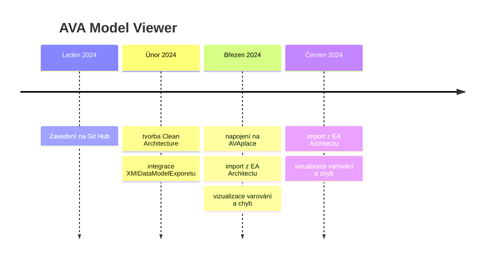
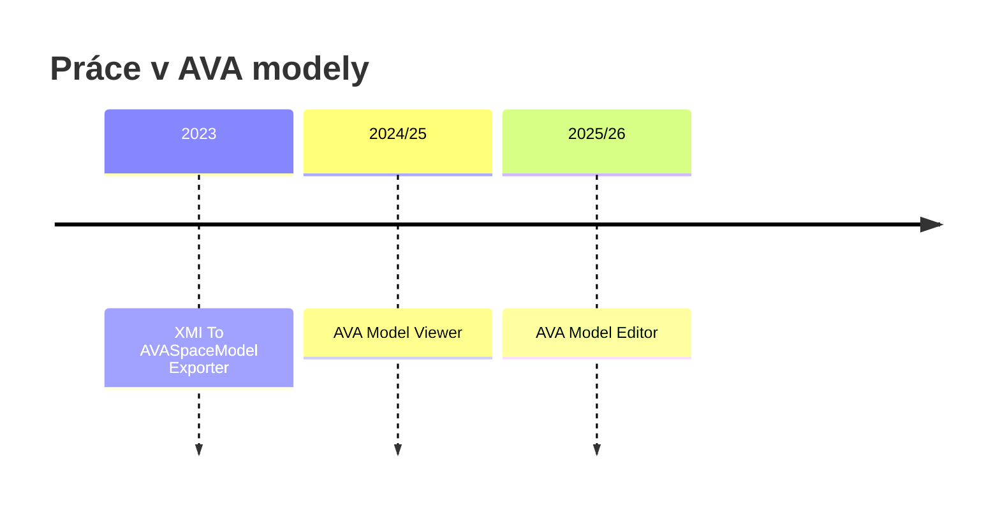

# AVA model viewer

Je takový soukromý projekt, který jsem si vytvořil pro sebe, abych kombinoval

  - učení nových tenchnologíí a principů
  - implmentoval vlastní nápadý z oblasti modelování a vizualizace na platformě [AVAPlace](https://avaplace.com).
  

